# Lab 1: Amazon FreeRTOS OTA #

> Over-the-air (OTA) update is a very common way for delivering updates to devices. Amazon FreeRTOS supports OTA updates to allow product makers for deploying firmware updates to one or more devices in their fleet.

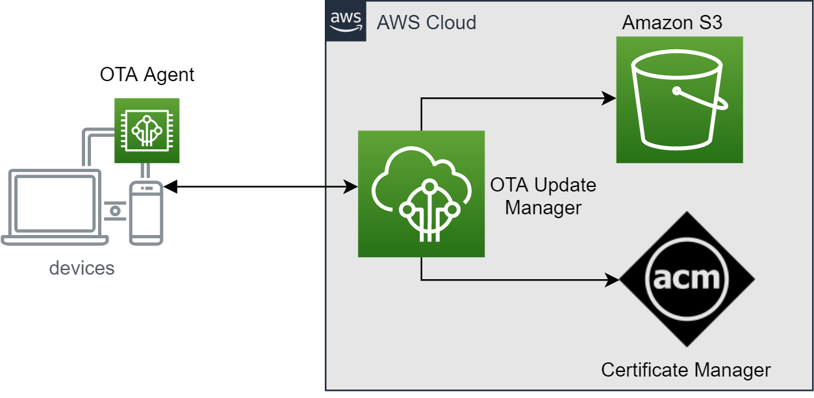

There are some components that involve in Amamzon FreeRTOS OTA updates:

* **OTA update manager service** creates AWS IoT jobs to notify devices for available updates when an OTA updates are created. OTA update manager also provides information of OTA updates.
* **OTA agent** runs on a device to publish requests to AWS IOT CORE and receives updates using HTTP or MQTT protocol when an update is available. It also checks the digital signature of downloaded files and installs firmware updates.
* **Amazon S3** is used to store OTA update files.
* **Certificate manager** is a service that helps to provision, manage, and deploy public and private certificates for using with AWS services

We will go through the following steps to finish Amazon FreeRTOS OTA demonstration  in this lab:

1. Enable OTA agent and install initial version of firmware on ESP32
1. Prepare a new signed firmware image and create OTA updates using OTA update manager
1. Deploy and activate the new firmware image on ESP32

## Prerequisite ##

1. Install [openssl](https://www.openssl.org/) and add it to system path. Or you can just install [Git for Windows](https://git-scm.com/) which will automatically install openssl.
2. Finish previous labs and make sure your board can connect to AWS IoT Core
3. Create Amazon S3 bucket for storing the OTA image
   * Sign in to the Amazon [S3 console](https://console.aws.amazon.com/s3/)
   * Choose **Create bucket**, type bucket name, and select your region (it should be the same one that is showed in your AWS IoT console region)
    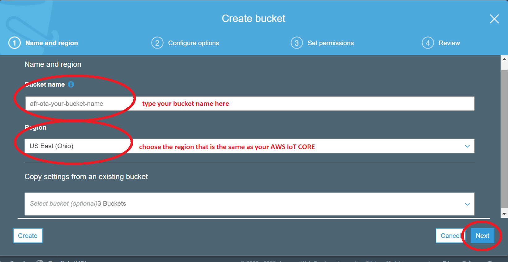
   * Select **Versioning** to **Keep all versions in the same bucket**, and then choose **Next**
    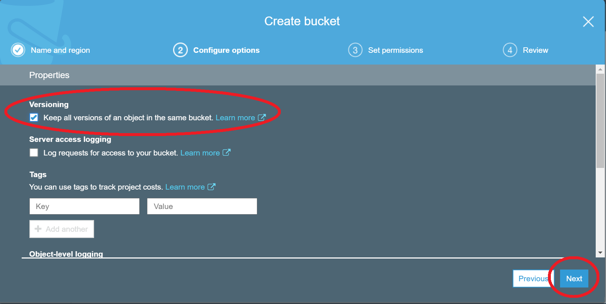
   * Choose **Next** to accept the default permissions
4. Create an OTA update service role and permissions for the role
   * Create service role
     * Go to [IAM]( https://console.aws.amazon.com/iam/), and choose **Roles** from the navigation pane
     * Choose **Create role**, and select **IoT** for your use case
    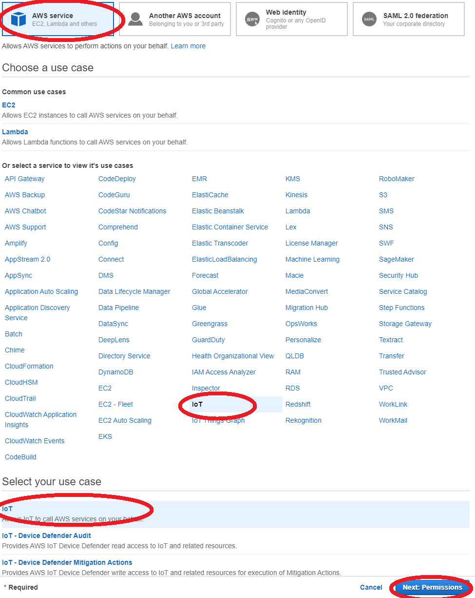
     * Choose **Next: Tags**, and then Choose **Next: Review**.
     * Enter a role name and description, and then choose **Create role**.
   * Add IAM permissions to OTA service role
     * Choose your role in IAM console page
     * Choose **Attach policies**, and attach **AmazonFreeRTOSOTAUpdate**
    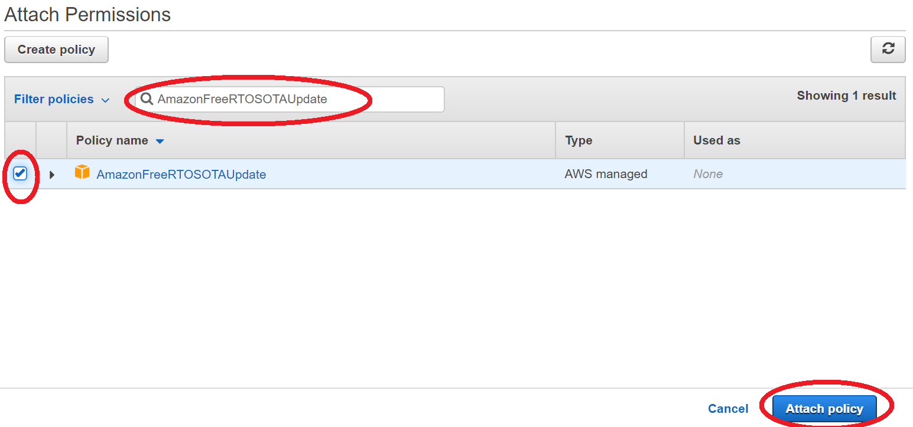
     * Choose **Add inline policy**, and add the following content in **JSON** tab. Then select **Review policy** and **Create policy**
        * Replace **\<your-account-id>** with your AWS account ID. You can find your AWS account ID in the upper right of the console. When you enter your account ID, remove any dashes (-)
        * Replace **\<role-name>** with the name of the IAM service role you just created

        ```json
        {
            "Version": "2012-10-17",
            "Statement": [
                {
                    "Effect": "Allow",
                    "Action": [
                        "iam:GetRole",
                        "iam:PassRole"
                    ],
                    "Resource": "arn:aws:iam::<your_account_id>:role/<your_role_name>"
                }
            ]
        }
        ```

        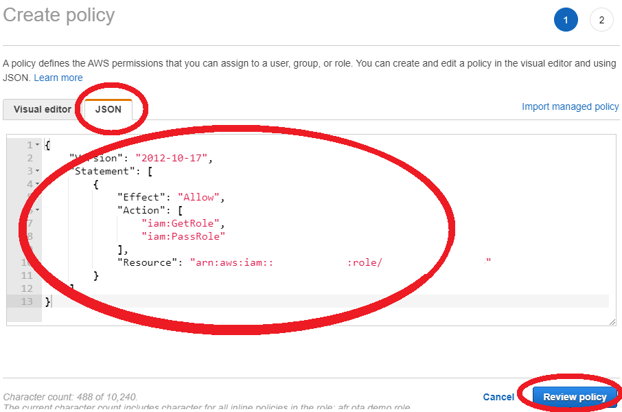
   * Add Amazon S3 permissions to OTA service role
     * Choose the created role in IAM console page
     * Choose **Add inline policy**, and add the following content in **JSON** tab. Then select **Review policy** and **Create policy**
        * Replace **\<example-bucket>** with the name of the Amazon S3 bucket where your OTA update firmware image will be stored

        ```json
        {
            "Version": "2012-10-17",
            "Statement": [
                {
                    "Effect": "Allow",
                    "Action": [
                        "s3:GetObjectVersion",
                        "s3:GetObject",
                        "s3:PutObject"
                    ],
                    "Resource": [
                    "arn:aws:s3:::<example-bucket>/*"
                    ]
                }
            ]
        }
        ```

        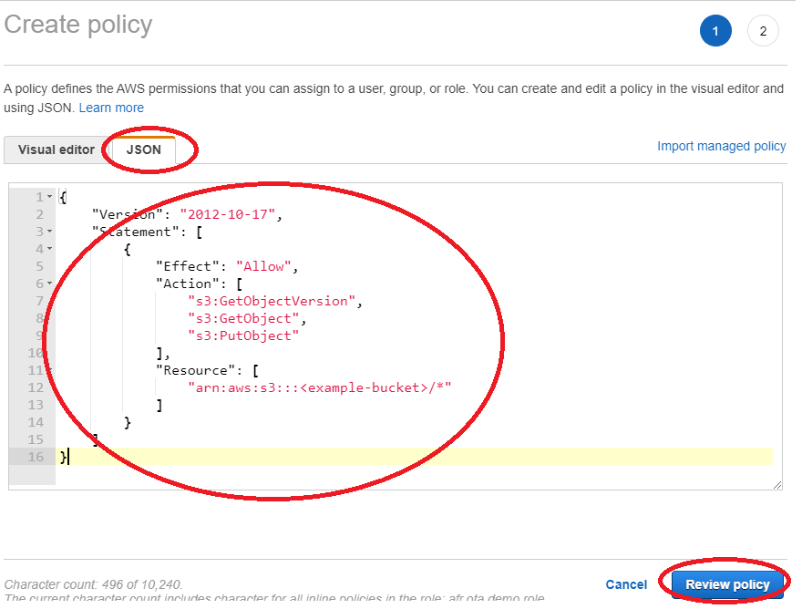

5. Add an OTA user policy
    > We should grant our IAM user permission to perform OTA updates.
   * Go to [IAM]( https://console.aws.amazon.com/iam/), and choose **Users** from the navigation pane
   * Choose your IAM user from the list, and choose **Add permissions**
   * Choose **Attach existing policies directly**, and **Create policy**
    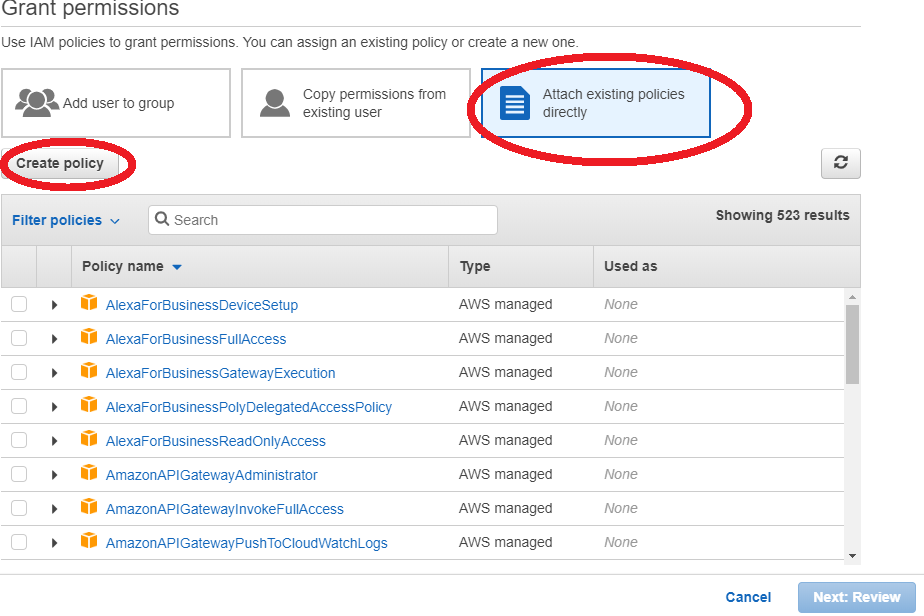
   * In the **JSON** tab, copy and paste the following content
        * Replace **\<example-bucket>** with the name of the Amazon S3 bucket where your OTA update firmware image will be stored
        * Replace **\<your-account-id>** with your AWS account ID. You can find your AWS account ID in the upper right of the console. When you enter your account ID, remove any dashes (-)
        * Replace **\<role-name>** with the name of the IAM service role you just created

        ```json
        {
            "Version":"2012-10-17",
            "Statement": [
                {
                    "Effect": "Allow",
                    "Action": [
                        "s3:ListBucket",
                        "s3:ListAllMyBuckets",
                        "s3:CreateBucket",
                        "s3:PutBucketVersioning",
                        "s3:GetBucketLocation",
                        "s3:GetObjectVersion",
                        "acm:ImportCertificate",
                        "acm:ListCertificates",
                        "iot:*",
                        "iam:ListRoles",
                        "freertos:ListHardwarePlatforms",
                        "freertos:DescribeHardwarePlatform"
                    ],
                    "Resource": "*"
                },
                {
                    "Effect": "Allow",
                    "Action": [
                        "s3:GetObject",
                        "s3:PutObject"
                    ],
                    "Resource": "arn:aws:s3:::<example-bucket>/*"
                },
                {
                    "Effect": "Allow",
                    "Action": "iam:PassRole",
                    "Resource": "arn:aws:iam::<your-account-id>:role/<role-name>"
                }
            ]
        }​
        ```

        

      * Choose **Create policy**
      * Go to **Users** from the navigation pane, and choose your IAM user from the list
      * Choose **Add permissions**, and then choose **Attach existing policies directly**
      * Search for the OTA user policy you just created and select the check box next to it
      * Choose **Next: Review** and **Add permissions**

## Enable OTA agent and install initial version firmware on ESP32 ##

1. OTA agent demonstration configuration
   * Open \<AmazonFreeRTOS>/vendors/espressif/boards/esp32/aws_demos/config_files/aws_demo_config.h
   * Comment out #define CONFIG_*_DEMO_ENABLED, and define **CONFIG_OTA_UPDATE_DEMO_ENABLED**

        ```c
        #define     CONFIG_OTA_UPDATE_DEMO_ENABLED
        ```

2. OTA protocol configuration
   * Open \<AmazonFreeRTOS>/vendors/espressif/boards/esp32/aws_demos/config_files/aws_ota_agent_config.h
   * Check the configuration of OTA protocols, we use **MQTT** as the default protocol

        ```c
        #define configENABLED_CONTROL_PROTOCOL      ( OTA_CONTROL_OVER_MQTT )

        #define configENABLED_DATA_PROTOCOLS        ( OTA_DATA_OVER_MQTT )

        #define configOTA_PRIMARY_DATA_PROTOCOL     ( OTA_DATA_OVER_MQTT )
        ```

   * *(Optional)* If you want to enable transfer data over **HTTP**

        ```c
        #define configENABLED_DATA_PROTOCOLS        ( OTA_DATA_OVER_HTTP )

        #define configOTA_PRIMARY_DATA_PROTOCOL     ( OTA_DATA_OVER_HTTPT )
        ```

        > Because of a limited amount of RAM of ESP32, we need to turn off BLE when enabling HTTP as an OTA data protocol

        Open \<AmazonFreeRTOS>/vendors/espressif/boards/esp32/aws_demos/config_files/aws_iot_network_config.h, and change enabled network to WIFI only

        ```c
        #define configENABLED_NETWORKS         (AWSIOT_NETWORK_TYPE_WIFI )
        ```

3. Code-signing certificate configuration
   > ESP32 support a self-signed **SHA-256 with ECDSA** code-signing certificate, we will use [openssl](https://www.openssl.org/) to generate private key and certificate
   * In your working folder, create and edit cert_config.txt. Replace YOUR_EMAIL_ADDRESS with your email address

        ```text
        [ req ]
        prompt             = no
        distinguished_name = my_dn

        [ my_dn ]
        commonName = YOUR_EMAIL_ADDRESS

        [ my_exts ]
        keyUsage         = digitalSignature
        extendedKeyUsage = codeSigning
        ```

   * Open your openssl command line tool (Or open git-bash if you installed Git for Windows)

        

   * Create ECDSA code-signing private key

        ```bash
        cd YOUR_WORK_FOLDER
        openssl genpkey -algorithm EC -pkeyopt ec_paramgen_curve:P-256 -pkeyopt ec_param_enc:named_curve -outform PEM -out ecdsasigner.key
        ```

   * Create an ECDSA code-signing certificate

        ```bash
        openssl req -new -x509 -config cert_config.txt -extensions my_exts -nodes -days 365 -key ecdsasigner.key -out ecdsasigner.crt
        ```

   * Go to [AWS Certificate Manager](https://console.aws.amazon.com/acm/home?p=cmr&cp=bn&ad=c), and click **Import a certificate**
  
        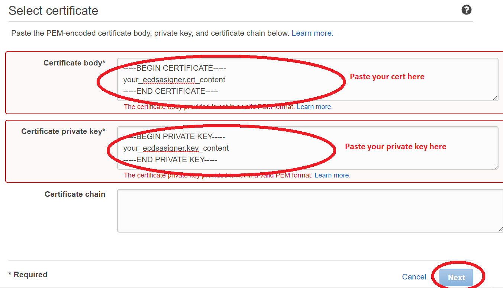
        

   * Add self-signed certificate for OTA agent
     * Open \<AmazonFreeRTOS>/demos/include/aws_ota_codesigner_certificate.h, and paste certificate to it. It should be formatted in the following way, and please **replace YOUR_BASE64_CERTIFICATE_DATA with yours**

        ```c
        static const char signingcredentialSIGNING_CERTIFICATE_PEM[] = "-----BEGIN CERTIFICATE-----\n"
        "YOUR_BASE64_CERTIFICATE_DATA\n"
        "-----END CERTIFICATE-----\n";
        ```

        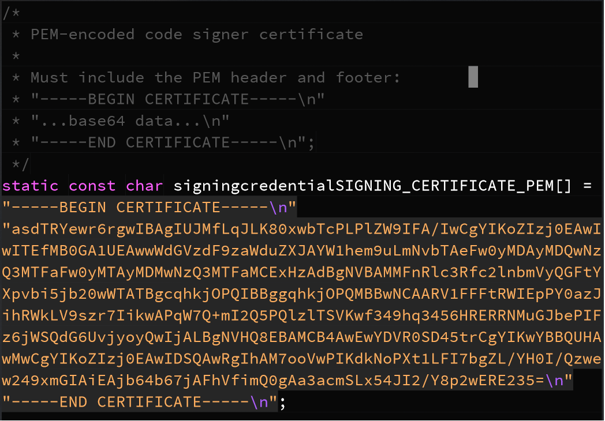

4. Build, install, and run firmware on ESP32 by refering to previous labs
        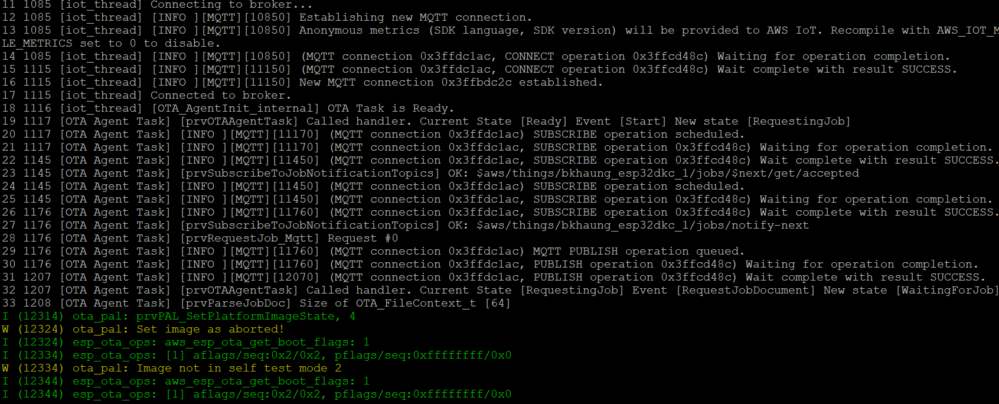

## Create OTA update ##

1. Create new firmware image
    > The OTA agent included with Amazon FreeRTOS checks the version of any update and installs it only if it is more recent than the existing firmware version

   * Edit \<AmazonFreeRTOS>/demos/include/aws_application_version.h and increment the APP_VERSION_BUILD token value

        ```c
        #define APP_VERSION_BUILD    6
        ```

   * Rebuild the new firmware image, the new image is put in \<AmazonFreeRTOS>/out/aws_demos.bin

2. Upload the new image to your S3 bucket
   * Sign in to the Amazon [S3 console](https://console.aws.amazon.com/s3/)
   * Select the bucket that you created in prerequisite, and choose **upload** icon to add your new aws_demos.bin image

3. Create an OTA update
   * Go to AWS IoT console to create a job
    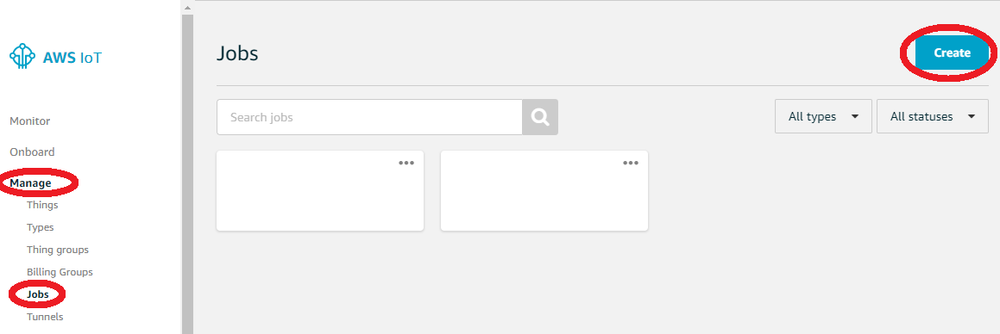
   * Choose **Create an Amazon FreeRTOS OTA update job**, and select your device name in **Things** tab
   * Create OTA update job. Choose **Next** after you fill all items
     * Create a code signing profile
     * Select the new firmware image in S3
     * Choose an IAM role for OTA jobs
     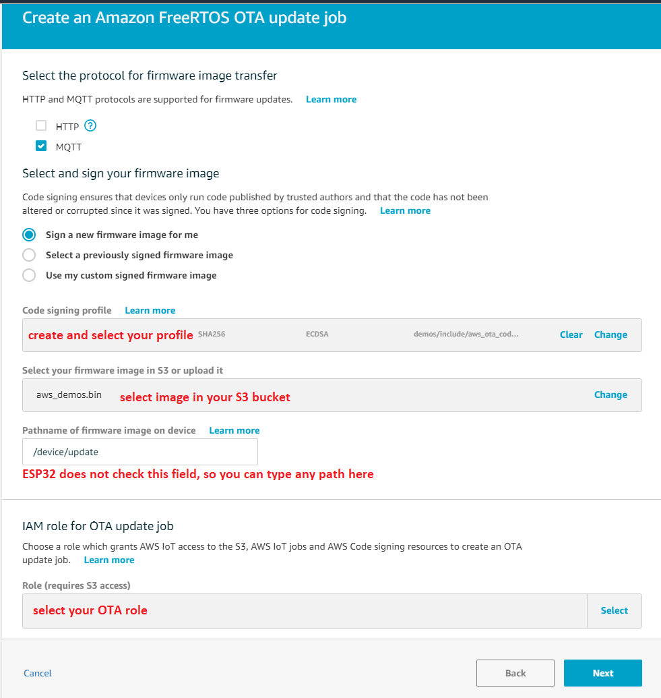
     
   * Under Job type, choose **Your job will complete after deploying to the selected devices/groups (snapshot)**. Then you can enter an ID and description for your OTA update job, and choose **Create**

## Activate OTA update ##

1. Connect to ESP32, and you will see the OTA agent is downloading, verifying, and testing the new firmware image
2. The new version is showed after the new firmware image is installed
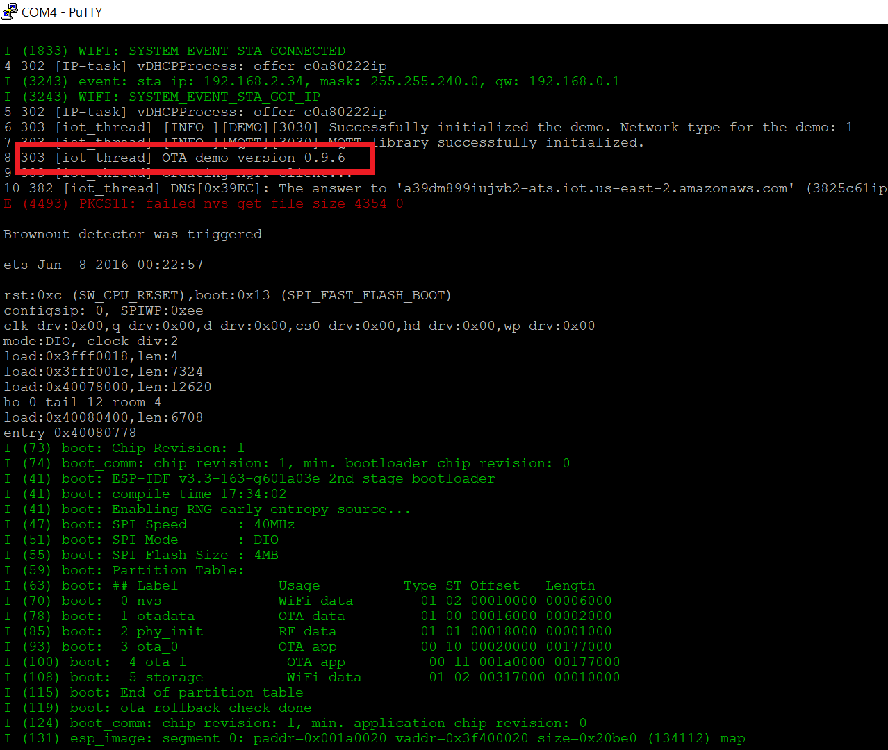
